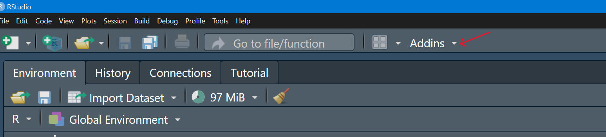
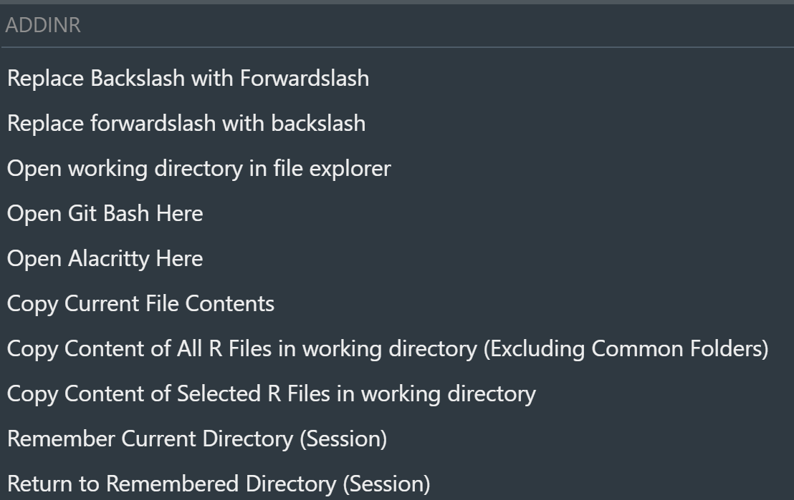

# addinR

A collection of useful RStudio addins to enhance your R development workflow with file management, directory navigation, and text manipulation utilities.

## Installation

Install directly from GitHub using the `devtools` package:

```r
# Install devtools if you haven't already
install.packages("devtools")

# Install addinR
devtools::install_github("Yousuf28/addinR")
```

After installation, restart RStudio to access the addins through the **Addins** menu.
### Menu



### ADDINR




## What This Package Does

The `addinR` package provides a suite of RStudio addins designed to streamline common development tasks that would otherwise require manual file operations or repetitive typing. These addins integrate seamlessly into your RStudio workflow, accessible through keyboard shortcuts or the Addins menu.

## How It Helps RStudio Users

### **Text Manipulation**
- **Replace Backslash with Forwardslash**: Instantly convert Windows-style paths (`\`) to Unix-style paths (`/`) in selected text
- **Replace Forwardslash with Backslash**: Convert Unix-style paths to Windows-style paths for cross-platform compatibility

### **File and Directory Operations**
- **Open Working Directory in File Explorer**: Quickly access your current working directory in your system's file manager (Windows Explorer, Finder, or Linux file manager)
- **Copy Current File Contents**: Copy the entire code/content of your active R file to the clipboard for pasting into chatbot
- **Copy All R Files**: copy code/content all R files from your working directory to clipboard, perfect for pasting into chatbot
- **Copy Selected R Files**: Interactively choose which R files content to copy from your working directory

### **Terminal Integration**
- **Open Git Bash Here**: Launch Git Bash terminal directly in your current working directory (Windows)
- **Open Alacritty Here**: Open Alacritty terminal in your current directory (cross-platform)

### **Session Directory Management**
- **Remember Current Directory**: Save directories during your R session
- **Return to Remembered Directory**: Quickly navigate back to previously saved directories and automatically update the Files pane

## Usage

After installation, access these tools through:
- **Addins menu** in RStudio's toolbar
- **Assign keyboard shortcuts** via Tools → Modify Keyboard Shortcuts
- **Command palette** (Ctrl/Cmd + Shift + P)


## Note
Tested on windows and MacOS but should work on linux.
